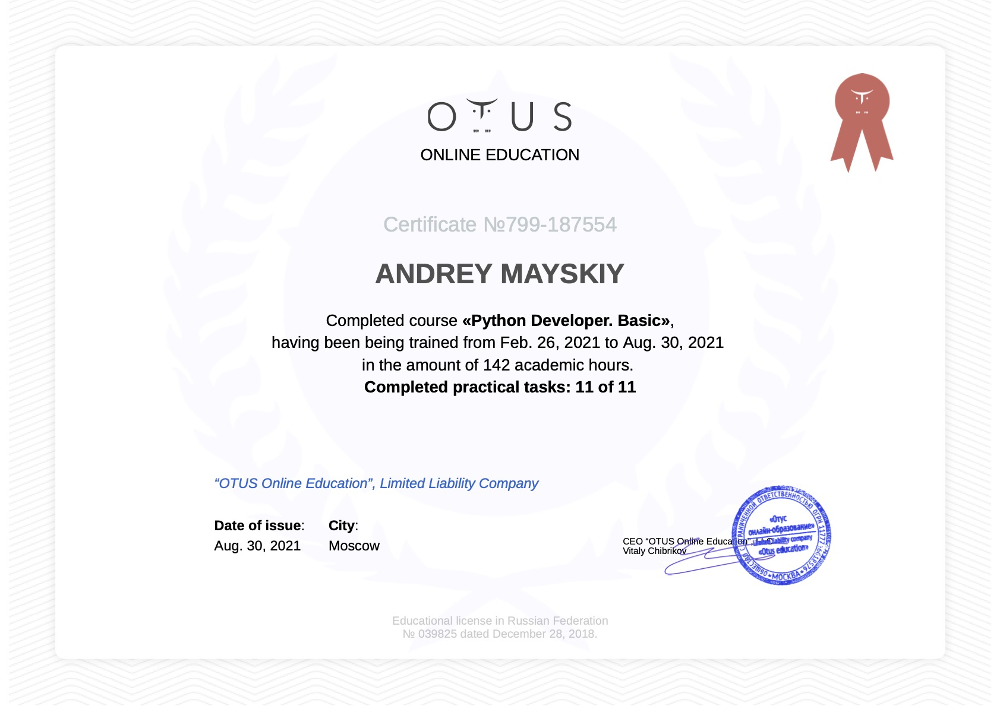

## PythonBase 2021-02 homeworks

> Andrey M

    

Tree:

- [X] homework_01
- [X] homework_02
- [X] homework_03
- [X] homework_04
- [X] homework_05
- [X] homework_06
- [X] homework_07
- [X] homework_08
- [X] homework_09
- [X] homework_10
- [X] homework_11 https://gitlab.com/Mayson90/otus-homework_11

### Notes

    # pytest
    $ pytest testing/test_homework_* -s -vv

branch for pull requests - *homeworks_check*
